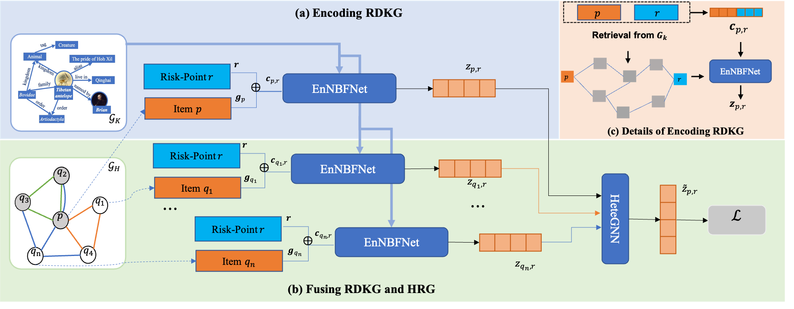

# KBPD: Knowledge Based Prohibited Item Detection on Heterogeneous Risk Graphs #
This is the official codebase of the paper

Knowledge Based Prohibited Item Detection on Heterogeneous Risk Graphs (论文链接待发布)

## Overview ##
KBPD is a strong model that fuse information from both knowledge graphs and heterogeneous risk graphs. 
It is the SOTA method in prohibited item detection and proved to be powerful through online testing in the largest Chinese second-hand commodity trading platform, Xianyu.
To make full use of rich expert knowledge, KBPD introduces the Risk-Domain Knowledge Graph (named RDKG), which is encoded by a path-based graph neural network method. 
Furthermore, to utilize information from both the RDKG and the Heterogeneous Risk Graph (named HRG), 
an interactive fusion framework is proposed and further improves performance in adversarial senario.
Actually, KBPD can be applied to many content classification tasks with **limit supervision and adversarial behavior problems**, and prohibited item detection is just one fundamental and representative task.



This codebase is based on PyTorch and [graph-learn]. 

[graph-learn]: https://github.com/alibaba/graph-learn/tree/master

## Installation ##

You may install dependencies via either conda or pip, and Python>=3.6 is required. 

### From Pip ###

```bash
pip install torch==1.8.0+cu111 -f https://download.pytorch.org/whl/lts/1.8/torch_lts.html
pip install graph-learn==1.1.0
pip install torch_geometric
```

## Reproduction ##
Because of business confidentiality, we cannot release our dataset used in this paper. 
However, we offer demo data with the same format, and detailed instruction about running models.
In pratical apllication, we use a two-stage training strategy to guarantee efficiency and stability. 

### RDKG Encoding ###
In the first stage, RDKG is encoded and embeddings are saved for later training.
```bash
python kbpd_kdd23/main_kg.py train
python kbpd_kdd23/main_kg.py test
```
Usually, you need run this command line for training and inference, with modification about data location in `config/config_kg.py`.
When inference, embeddings are saved in the output file automatically. About data format, there is detailed explanation in `config/config_kg.py`.

### Fusion with HRG ###
In the second stage, embeddings from RKDG are passed through HRG.
```bash
python kbpd_kdd23/main_hrg.py train
python kbpd_kdd23/main_hrg.py test
```
Usually, you need run this command line for training and inference, with modification about data paths in `config/config_hrg.py`.
About data format, there is detailed explanation in `config/config_hrg.py`.
